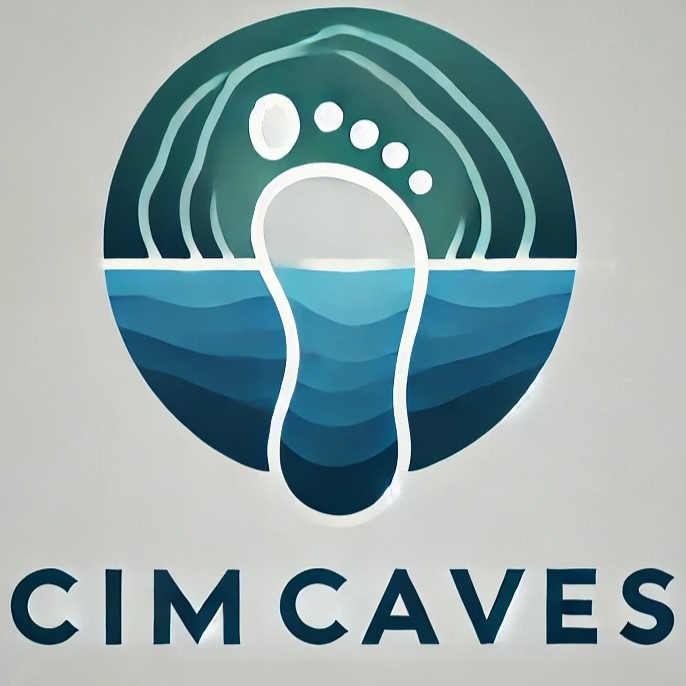

# CIMcaves Survey privacy police and consent form content

This website contains both a privacy policy and a consent form to comply with international legislation for the online survey about cumulative impacts on marine caves for the CIMcaves investigation led by the University of La Laguna (Spain), in which the collaborating organizations are the Ionian University (Greece), the Spanish Institute of Oceanography (Spain) and the University of Burgos (Spain).

If you are a scientist working for a university, research institution, government agency, NGO, or private company with some knowledge of marine caves, or if you are an experienced diver in marine caves, we would love for you to participate in this survey. You can find it here: https://rebrand.ly/CIMcaves-survey